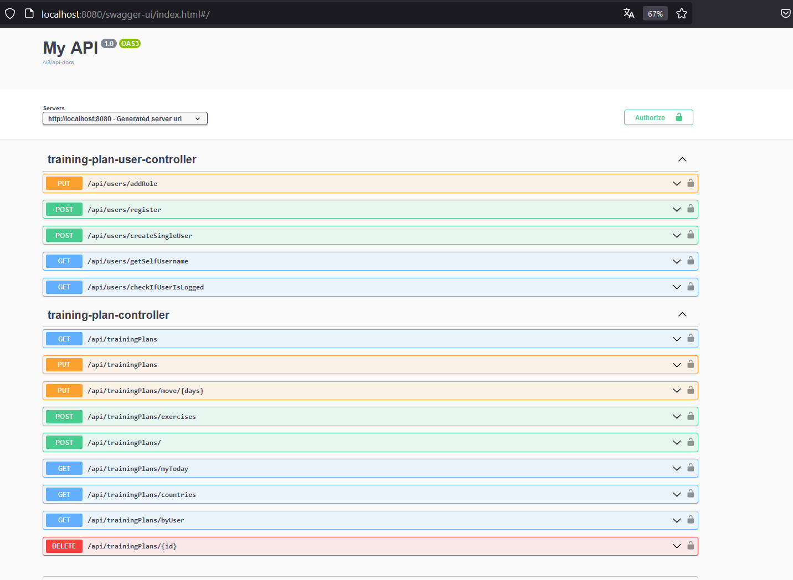
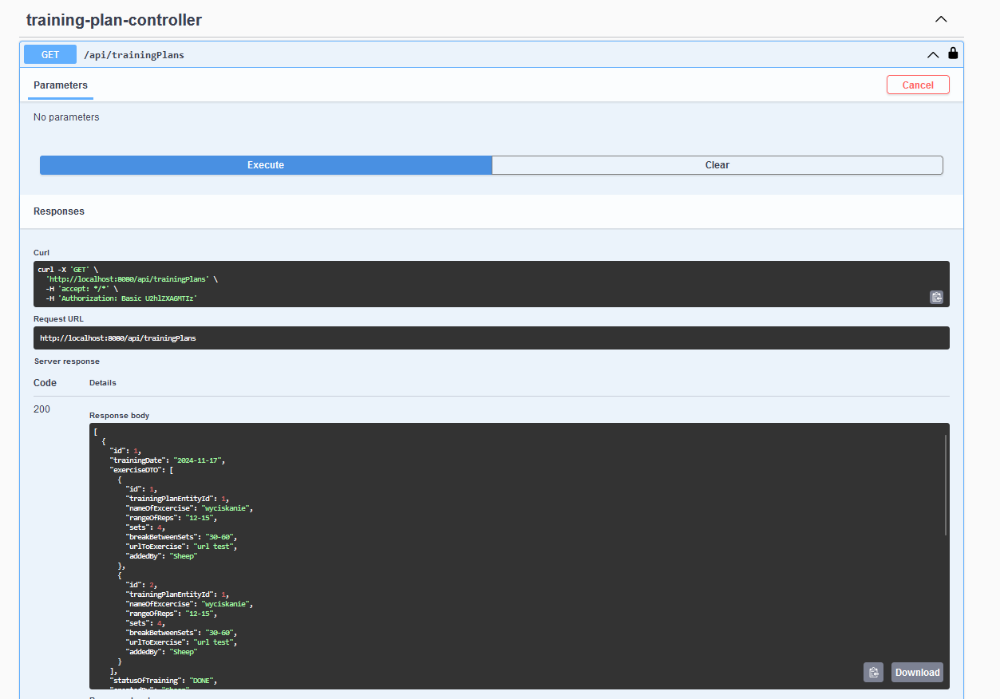

Project for managing daily exercises and create training plans.
Methods in project create, modify, delete, and read training plan with exercises inside,
add exercise to already existed training plan, move training plan for int days.

How to run project? Download project, add as maven and download all dependency, open command line in root file, type docker compose up in command line, type mvn spring-boot:run, next  when you run type in browser http://localhost:8080/swagger-ui/index.html for open swagger. You will see swagger with lock, that lock authorize, default user to authorize using lock: username is Sheep and password 123 that user have admin roles.
You can create own user with User role, you don't need to log to create user, endpoint /api/users/register give you opportunity to create own user with user role.
When you create own user you can use almost all endpoints.
Endpoints only for admin:
- POST /api/users/createSingleUser
- PUT /api/users/addRole
- GET /api/trainingPlans

How will look swagger:

Example what will return endpoint:

Used technologies:
Hibernate, Spring boot, Liquibase, Spring Security, Feign Client

Project created by: 
Dominik Jankowski

